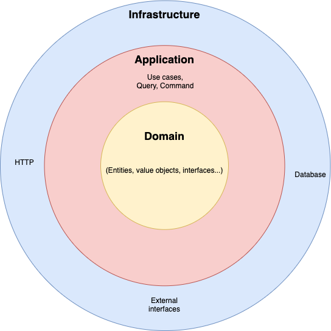

#### What is this?

A way to organize the code, and the relationships in order to our code will be more flexible and easy to support changes in the future of the parts more prone to change.

0. Prerequisites (SOLID)
    - [Inversion of control (Dependency injection)](https://en.wikipedia.org/wiki/Inversion_of_control)
    - [Single responsibility](https://en.wikipedia.org/wiki/Single-responsibility_principle)

1. Application
   - Application services/use cases 👉 Coordinate the flow, and the calls to our domain code.
     For example, do a request to the repository to get anything and return the data.
   - The application service build a transactional boundary for operations with database or events. 
     
2. Domain
   Business rules that only can change for OUR decisions
    - **Entities** 👉 Object that represents the reality of business. 
       - Example: A class that represents an image of an ad
    - **Value objects** 👉 Objects that are identified by the value and not for an id.
       - Example: we can model a Value Object that represents an Phone number, and we can encapsulate all the logic related with the phone number inside tha value object.
    - **Aggregates** 👉 Group of entities that have a business meaning, this aggregate have an Aggregate root that is the entity actuating like entry point of the aggregate. 
      - Example, A class that represents and Ad with all his multimedia's, descriptions, features, ids, etc.
    - **Domain services** 👉 When we need **reuse** some coordination logic between multiple use cases we can create a domain services in order to encapsulate this logic.
    - **Interfaces** 👉 The way to decouple the infrastructure of our domain code, so we can change the implementation of this infrastructure code without the need of change any code inside our domain

3. Infrastructure

   - The implementations of interfaces defined in the domain like repositories
   - Code that have relationships with I/O
   - Code related with frameworks (ORMs, etc.)
   - Code that interactuate with the external world of our code (HTTP, etc.)
    

#### Hexagonal vs Layer Architecture

The domain knows the database so is more difficult to change the database

#### Relationship rule:
The relations only **MUST** be from outside to inside

    